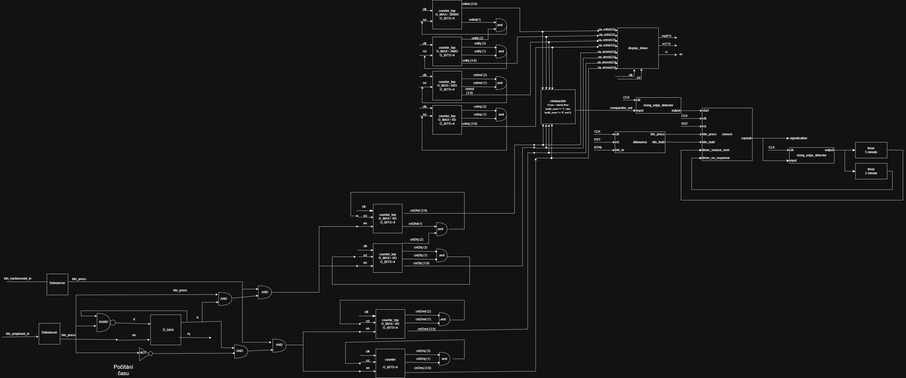
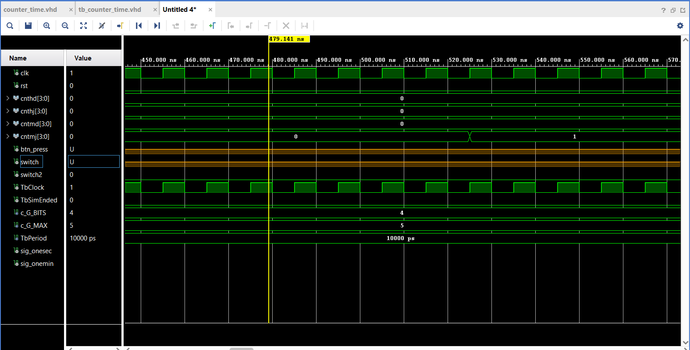

# 24-hour Alarm Clock

V tomto projektu se budeme zabývat vytvořením funkčních digitálních 24hodinových hodin s integrovanou funkcí alarmu, implementované na vývojové desce Nexys A7-50T.
Systém udržuje přesný čas pomocí kaskády čítačů a umožňuje uživateli nastavit čas buzení. Aktuální čas a nastavený alarm jsou zobrazeny současně na osmi pozicích sedmisegmentového displeje díky technice časového multiplexingu.

## Členové týmu a kompetence
* Martin Doucha
* Jan Kocourek
* Pavel Čurda

## Blokové schéma

## Vstupy
Ovládání systému je realizováno pomocí tlačítek na desce Nexys:
* **BTNC**: Hlavní reset celého systému.
* **BTNL**: Tlačítko vypnutí alarmu.
* Další tlačítka budou využita pro nastavení hodnot času a alarmu.

## Výstupy
Výstupní data jsou zobrazena na následujících periferiích:

### Sedmisegmentový displej
* **DISP 0 až 3**: Zobrazení aktuálního času (hodiny a minuty).
* **DISP 4 až 7**: Zobrazení času nastaveného alarmu.

### Dvojtečka (DP)
* Slouží k vizuálnímu oddělení hodin a minut nebo indikaci vteřinového taktu.

## Komponenty
### Snooze
Hlavní řídící logický blok pro zapínání a vypínání budíku alarmu.

### rising_edge_detector
Pomocná součástka která vytvoří jedni clockový puls při detekci náběžné hrany.

### debounce
Upravená součástka z počítačových cvičení, s detekcí držení.

### countery_cas = aktuální čas
Tato součástka má dva režimy, které se dají přepínat switch2. Když je hodnota switche2 0 čas je měřen (pomocí pulzu na clk_en) a komponenta funguje jako hodiny. Pokud je switch2 na hodnotě 1, je možno nastavovat čas pomocí tlačítka a switche jako u counter_set_time.
Switch 2 je na 0, to znamená že čas samovolně běží:

Switch 2 je na 1 a switch na 1 ,to znamená, že je možno tlačítkem přenastavovat hodiny

Switch 2 je na 1 a switch na 0 ,to znamená, že je možno tlačítkem přenastavovat hodiny

### counter_time
Součástka složená z kombinace součástek countery_cas a clk_en. Protože pro určení jedné minuty s frekvencí 100 MHz by G_MAX bylo příliš velké číslo, je zde zaveden komponent clk_en s hodnotou G_MAX = 100_000_000, který generuje puls každou sekundu. Tyto pulsy jsou pak počítány counterem v procesu p_minute_maker, který sčítá sekundové pulsy a každou minutu vygeneruje puls sig_one_mini, který je přiveden na en vstup součástky countery_cas.

Simulace přechodů minut (cnt2mj a cnt2md):

Simulace přechodů hodin (cnt2hj a cnt2hd):

Simulace překlopení z 23:59 na 0:00 :

### counter_set_time = budík
Upravený blok counterů pro nastavování času budíku. Pomocí switche je možno přepínat mezi nastavováním minut a hodin.
Simulace nastavování hodin (poloha switche 0):

Simulace nastavování minut (poloha switche 1):

