# 24-hour Alarm Clock

V tomto projektu se budeme zabývat vytvořením funkčních digitálních 24hodinových hodin s integrovanou funkcí alarmu, implementované na vývojové desce Nexys A7-50T.
Systém udržuje přesný čas pomocí kaskády čítačů a umožňuje uživateli nastavit čas buzení. Aktuální čas a nastavený alarm jsou zobrazeny současně na osmi pozicích sedmisegmentového displeje díky technice časového multiplexingu.

## Členové týmu a kompetence
* Martin Doucha
* Jan Kocourek
* Pavel Čurda

## Blokové schéma
alarm_clock_top

snooze_top

## Vstupy
Ovládání systému je realizováno pomocí tlačítek na desce **Nexys A7-50T**:
* **BTNC**: Hlavní reset celého systému – vynuluje čas, zruší aktivní alarm a resetuje vnitřní automaty.
* **BTNL**: Multifunkční tlačítko pro ovládání alarmu:
    * **Krátký stisk**: Aktivace funkce **Snooze** (odložení buzení o 5 minut).
    * **Dlouhý stisk (Hold)**: Úplné vypnutí (Stop) alarmu.
* **CLK (Pin E3)**: Zdroj hodinového signálu 100 MHz.

## Výstupy
Výstupní data jsou zobrazena na následujících periferiích:

### Sedmisegmentový displej
Data jsou zobrazena pomocí časového multiplexu (obnovovací frekvence cca 1 kHz).
* **DISP 0 až 3**: Zobrazení aktuálního času ve formátu `HH:MM`.
* **DISP 4 až 7**: Zobrazení času nastaveného alarmu ve formátu `HH:MM`.
* **Segmenty (A-G)**: Výstupní sběrnice `seg(6:0)` pro ovládání jednotlivých segmentů (společná anoda).
* **Anody (AN0-AN7)**: Výstupní sběrnice `an(7:0)` pro aktivaci konkrétní cifry.

### Dvojtečka (DP)
* Indikátor vteřinového taktu. Bliká v rytmu 1 Hz (0,5 s svítí / 0,5 s nesvítí) pro vizuální potvrzení běhu hodin.

### LED signalizace
* **LED16_R (červená)**: Signalizuje aktivní stav buzení. Svítí, dokud není alarm potvrzen tlačítkem nebo neuplyne časový limit.

---

## Komponenty systému

### Snooze (snooze_top)
Hlavní řídicí blok budíku, který integruje:
* **Debounce**: Ošetření mechanických zákmitů tlačítek a detekce délky stisku.
* **Timery**:
    * **2 minuty**: Automatické ukončení buzení při nečinnosti.
    * **5 minut**: Odpočet pro opakované buzení (Snooze).
* **FSM**: Konečný automat přepínající stavy mezi IDLE, ACTIVE (zvonění) a SNOOZE.

Simulace snooze bloku a jeho reakci na spuštění a samostatného vypnutí po uplynutí času. Puls start vybudí změnu stavu do aktivního, kde squak se přepne na vysokou úroveň. Po nějaké době, přijde puls že nebyla žádná reakce, a čeká se na 5 minutový timer (snooze_over) až znovu zapne aktivní stav. Aktivní stav se ukončí po dlouhém stisku tlačítka.
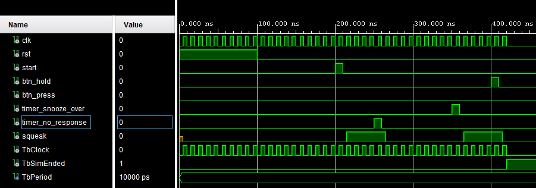

Simulace snooze bloku a jeho reakci na spuštění a odložení alarmu tlačítkem. Stejně jako v předchozí simulaci, s rozdílem že odložení zvonku je provedeno krátkým stiskem tlačítka.
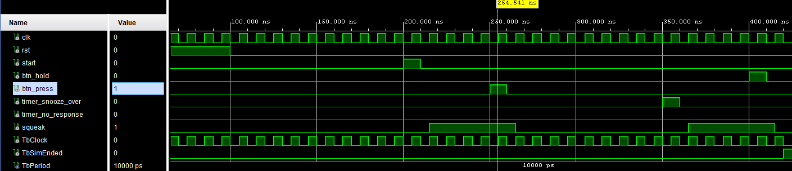

### Time Counter (counter_auto)
Logika zajišťující inkrementaci času. 
* Obsahuje vnitřní děličku frekvence (`clk_en`) pro získání vteřinového taktu.
* Spravuje přechody: 59 s → 0 s, 59 min → 0 min a 23:59:59 → 00:00:00.

### Comparator
Digitální porovnávač, který v každém taktu kontroluje shodu mezi aktuálním časem a nastaveným alarmem. Při shodě vysílá aktivační signál do bloku Snooze.

### Display Driver
Zajišťuje dynamický multiplexing pro 8 cifer displeje. Převádí BCD data na kódy pro 7 segmentů pomocí sub-modulu `bin2seg`.

### rising_edge_detector
Pomocná součástka která vytvoří jedni clockový puls při detekci náběžné hrany.

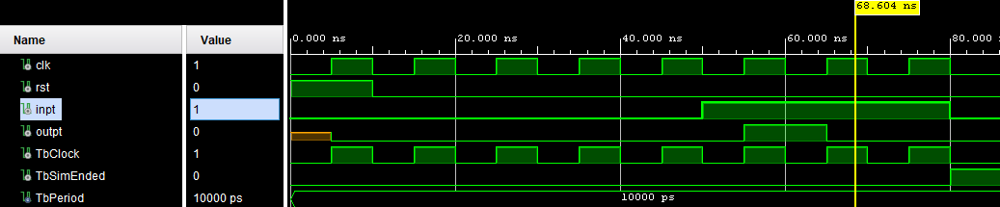

### debounce
Upravená součástka z počítačových cvičení, s detekcí držení.

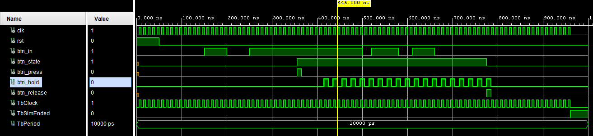

### countery_cas = aktuální čas
Tato součástka má dva režimy, které se dají přepínat switch2. Když je hodnota switche2 0 čas je měřen (pomocí pulzu na clk_en) a komponenta funguje jako hodiny. Pokud je switch2 na hodnotě 1, je možno nastavovat čas pomocí tlačítka a switche jako u counter_set_time.
Switch 2 je na 0, to znamená že čas samovolně běží:  Simulace zde: [tb_counter_time](projekt/testbenche/tb_counter_time.vhd).
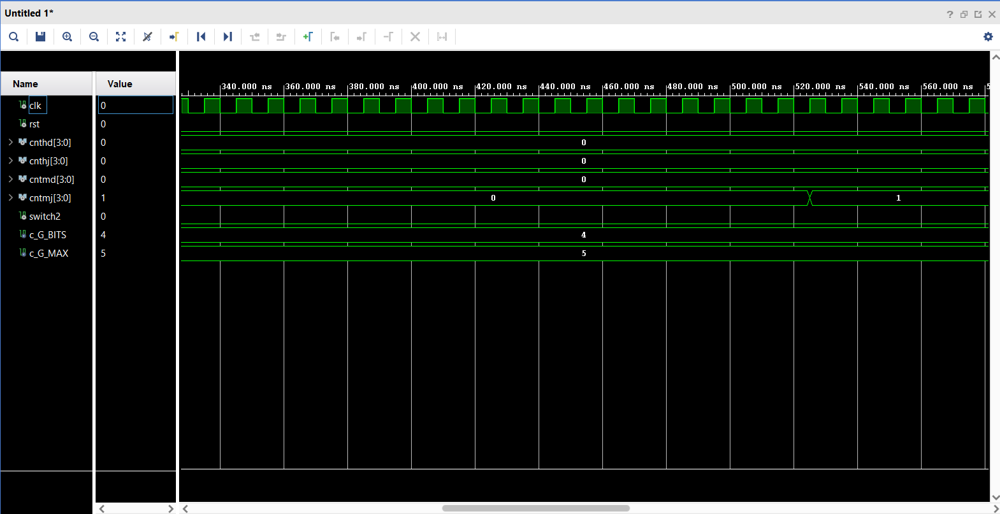
Switch 2 je na 1 a switch na 1 ,to znamená, že je možno tlačítkem přenastavovat hodiny
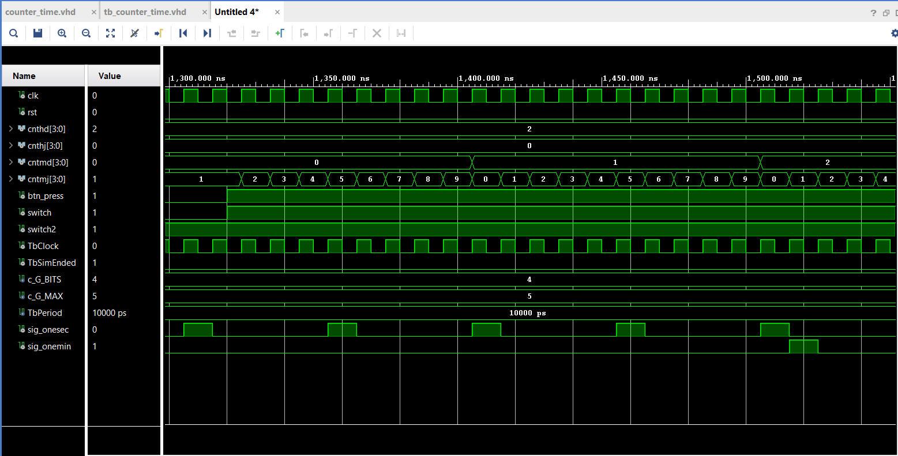
Switch 2 je na 1 a switch na 0 ,to znamená, že je možno tlačítkem přenastavovat hodiny
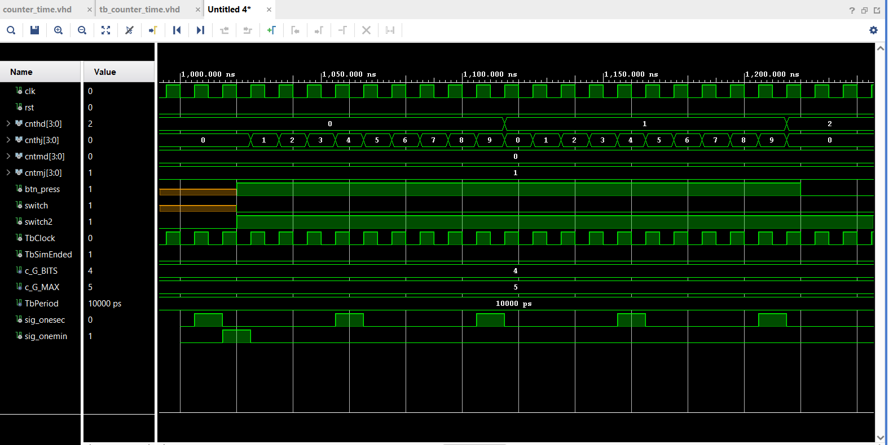

### counter_time
Součástka složená z kombinace součástek countery_cas a clk_en. Protože pro určení jedné minuty s frekvencí 100 MHz by G_MAX bylo příliš velké číslo, je zde zaveden komponent clk_en s hodnotou G_MAX = 100_000_000, který generuje puls každou sekundu. Tyto pulsy jsou pak počítány counterem v procesu p_minute_maker, který sčítá sekundové pulsy a každou minutu vygeneruje puls sig_one_mini, který je přiveden na en vstup součástky countery_cas.

Simulace přechodů minut (cnt2mj a cnt2md):
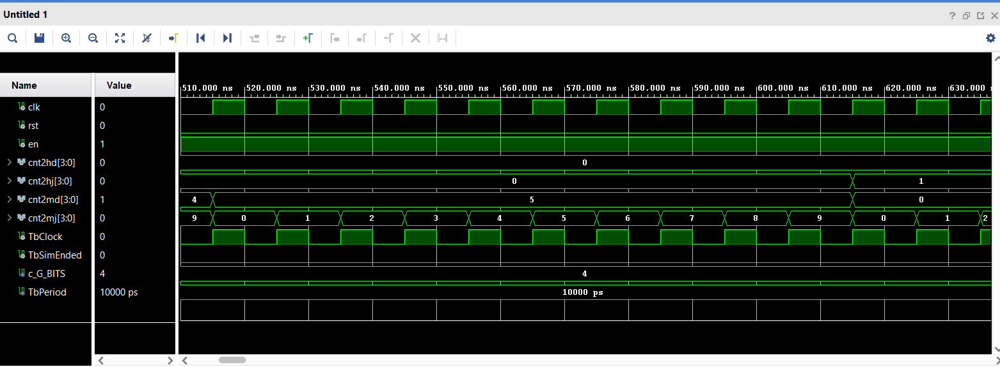

Simulace přechodů hodin (cnt2hj a cnt2hd):
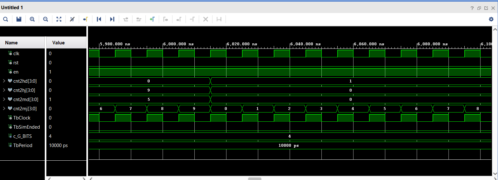

Simulace překlopení z 23:59 na 0:00 :
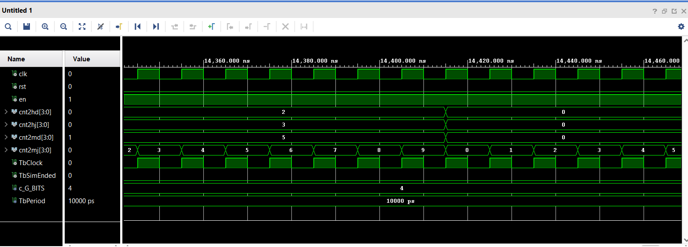

### counter_set_time = budík
Upravený blok counterů pro nastavování času budíku. Pomocí switche je možno přepínat mezi nastavováním minut a hodin.
Simulace nastavování hodin (poloha switche 0):
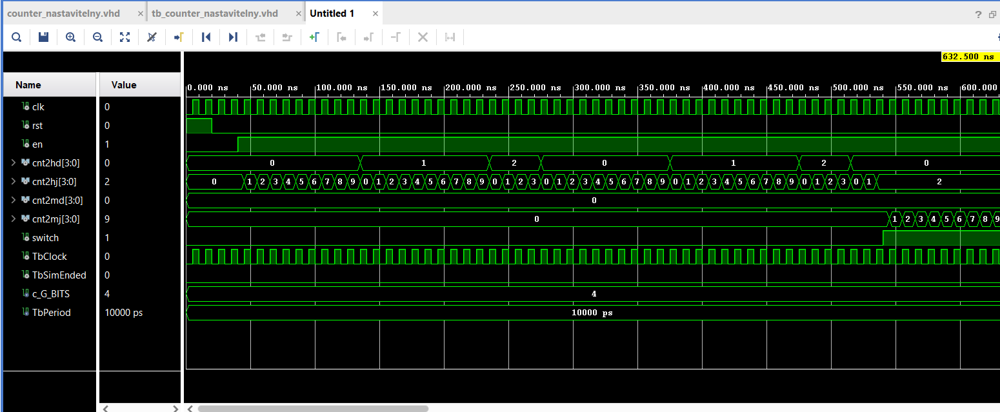
Simulace nastavování minut (poloha switche 1):
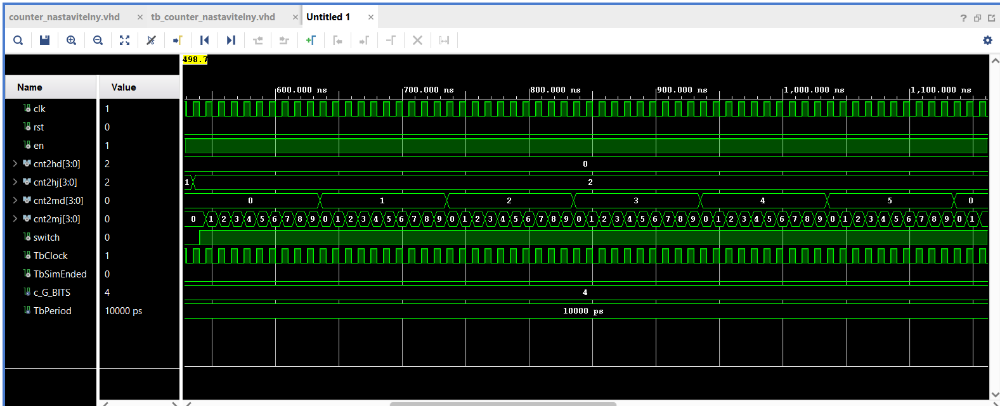

